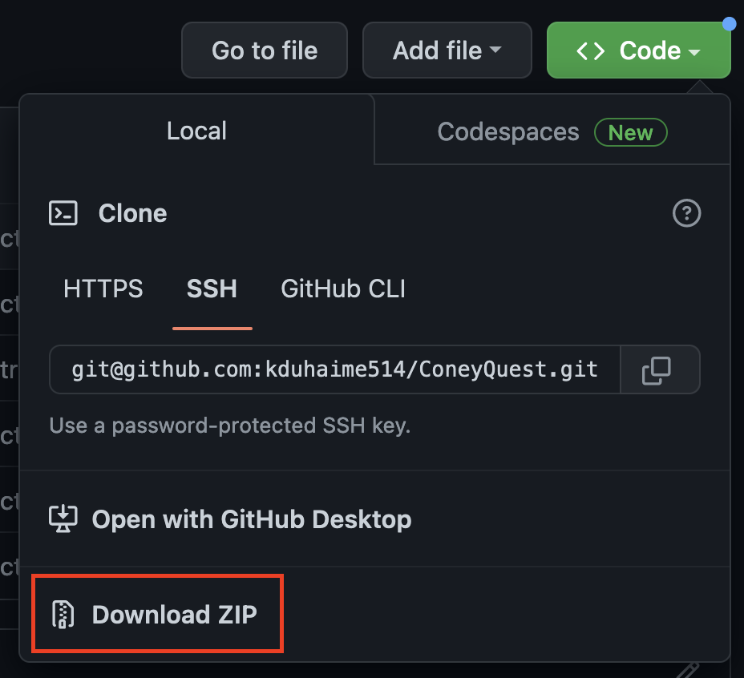

# Installation

## Option 1: Use git...
1. Navigate to `/path/to/wow/_retail_/interface/addons`
2. Run `git clone git@github.com:kduhaime514/ConeyQuest.git`

## Option 2: Direct install
1. Download the zip file...

    
2. Extract it into your `/path/to/wow/_retail_/interface/addons` folder
  * You need to name the folder `ConeyQuest`
  * One directory down from `/addons/ConeyQuest` should contain all the other contents, such as ConeyQuest.toc

## Option 3: CurseForge
https://www.curseforge.com/wow/addons/coneyquest